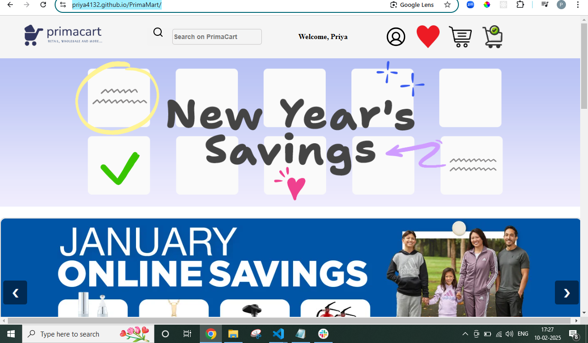
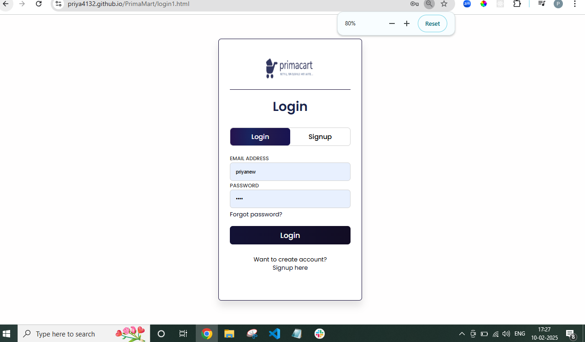
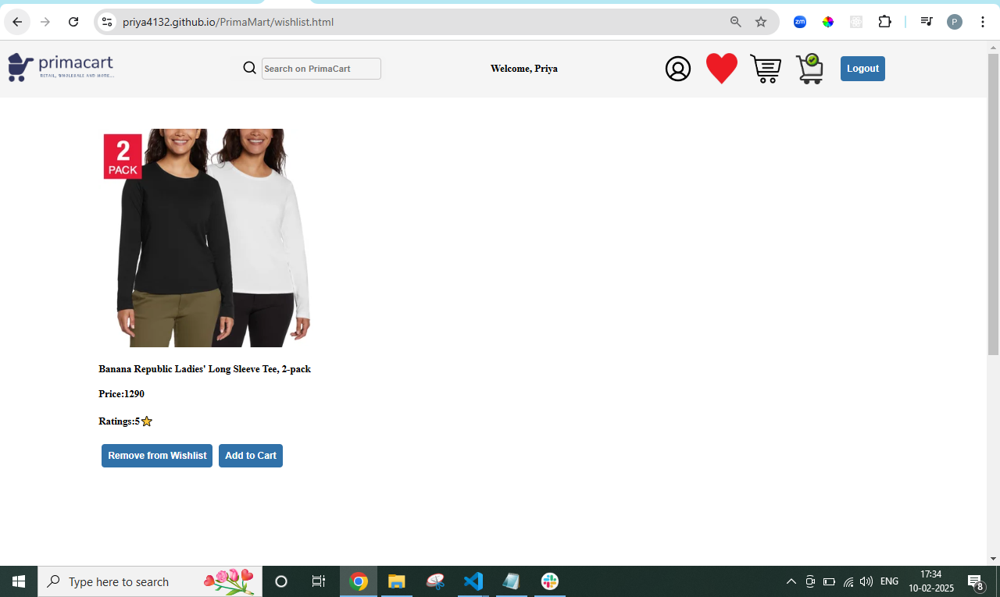
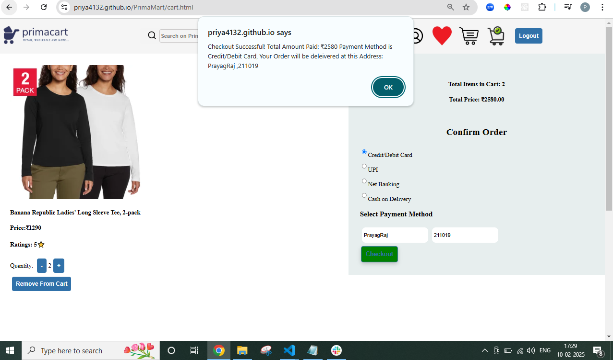
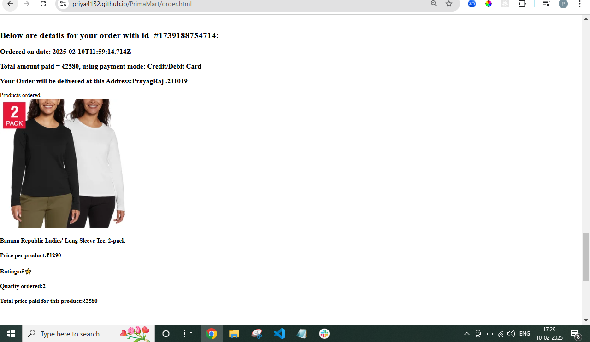

# Primacart E-commerce

Primacart is a modern e-commerce platform designed to provide a seamless online shopping experience. This web application allows users to browse products, add items to cart, and complete purchases with ease.

## 🌟 Features

- **User-friendly Interface**: Clean and intuitive design for easy navigation
- **Admin-Panel**: To add/delete/mange stock in the database.
- **Product Catalog**: Browse through various product categories
- **Shopping Cart**: Add/remove items and manage quantities
- **Responsive Design**: Fully responsive layout that works on desktop and mobile devices

## 🛠️ Technologies Used

- HTML5
- CSS3
- JavaScript
- Glitch for Backend(https://polarized-concrete-desert.glitch.me)
- GitHub Pages (for hosting)

## 🚀 Live Demo

Check out the live version of PrimaMart: [Primacart Live](https://priya4132.github.io/PrimaMart/)

## 💻 Getting Started

To run this project locally:

1. Clone the repository
   ```bash
   git clone https://github.com/priya4132/PrimaMart.git
   ```

2. Navigate to the project directory
   ```bash
   cd Primacart
   ```

3. Open `index.html` in your preferred browser

## 📱 Screenshots
 ### Home Page



 ### Login/Signup Page


 ### Wishlist Page


 ### Cart Page


 ### Orders Page


*[Add screenshots of your application here]*

## 🤝 Contributing

Contributions, issues, and feature requests are welcome! Feel free to check the [issues page](https://github.com/priya4132/PrimaMart/issues).

## ⭐ Show your support

Give a ⭐️ if you like this project!

## 📝 License

This project is [MIT](LICENSE) licensed.

## 👤 Contact

- GitHub: [@priya4132](https://github.com/priya4132)